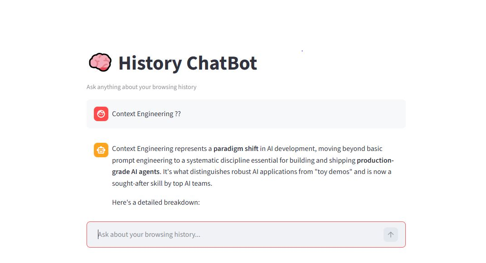
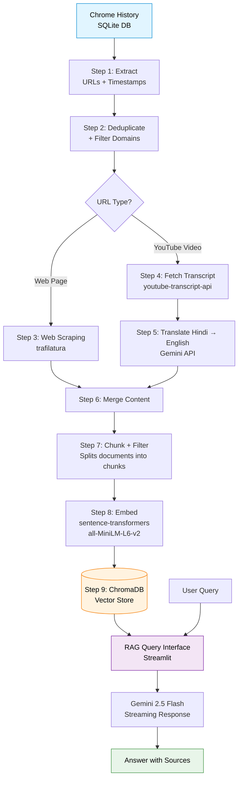

# 🧠 History ChatBot

> A RAG-powered chatbot that lets you query your own browsing history in natural language.

Ever read a great article last week and can't find it now? Watched a YouTube tutorial and forgot which one explained that one concept? This project turns your Chrome history into a personal knowledge base you can chat with.

## 🎯 Problem

We consume tons of content daily — articles, blog posts, YouTube videos, documentation. But our memory is limited and browser history is just a flat list of URLs. There's no way to ask *"what did I read about RAG architecture last week?"* and get a useful answer.

This project solves that by building a complete RAG (Retrieval Augmented Generation) pipeline over your own browsing data.

## 🎬 Demo



## 🏗️ System Architecture


## ⚙️ Pipeline Steps

| Step | Component | Input | Output |
|------|-----------|-------|--------|
| 1 | Chrome History Extraction | SQLite DB | Raw URLs + timestamps |
| 2 | Deduplicate & Filter | Raw history | Cleaned unique URLs |
| 3 | Web Scraping | Web URLs | Article text |
| 4 | YouTube Transcripts | YouTube URLs | Video transcripts |
| 5 | Translation (Hindi → English) | Hindi transcripts | English transcripts |
| 6 | Merge | Web + YT content | Unified content |
| 7 | Chunking | Long documents | 500-char chunks |
| 8 | Embedding | Text chunks | 384-dim vectors |
| 9 | Vector Storage | Vectors + metadata | ChromaDB collection |
| Query | RAG Pipeline | User question | Streaming answer |

## 🛠️ Tech Stack

| Component | Choice | Why |
|-----------|--------|-----|
| Vector DB | **ChromaDB** | Lightweight, runs locally, no setup overhead |
| Embeddings | **sentence-transformers (all-MiniLM-L6-v2)** | Free, fast, runs on CPU, 384-dim vectors |
| Web Scraping | **trafilatura** | Best-in-class content extraction, removes boilerplate |
| YouTube | **youtube-transcript-api** | Direct transcript access without YouTube Data API |
| Translation | **Gemini 2.5 Flash** | Cheapest LLM with strong multilingual support |
| LLM | **Gemini 2.5 Flash** | Streaming, low-cost ($0.15/1M input tokens), generous free tier |
| UI | **Streamlit** | Rapid prototyping, built-in chat components, streaming support |
| Orchestration | **Custom Python orchestrator** | Full control, easy debugging, no framework overhead |

## 📁 Project Structure
'''
History_Chat_bot/
├── code_pipeline/              # All pipeline scripts
│   ├── chrome_history_extraction.py
│   ├── deduplicate.py
│   ├── web_extraction.py
│   ├── youtube_transcript.py
│   ├── youtube_translate_script.py
│   ├── merge_content.py
│   ├── chunking.py
│   ├── embeddings.py
│   ├── vector_store.py
│   ├── query.py
│   └── app.py                  # Streamlit UI
├── config/
│   └── config.py               # All configuration constants
├── data/                       # Generated JSON files (gitignored)
├── chroma/                     # Vector database (gitignored)
├── logs/                       # Pipeline logs (gitignored)
├── learning_docs/              # Personal notes & TODOs
├── tests/                      # Unit tests
├── orchestrator.py             # Runs the full pipeline end-to-end
├── requirements.txt
├── .env                        # API keys (gitignored)
└── README.md
'''

## 🚀 Setup

### Prerequisites

- Python 3.11+
- Google Chrome installed
- Gemini API key ([get one here](https://aistudio.google.com))

### Installation
```bash
# Clone the repository
git clone https://github.com/prabhatsin/History_Chat_bot.git
cd History_Chat_bot

# Create virtual environment
python -m venv myenv
myenv\Scripts\activate   # Windows
# source myenv/bin/activate   # Mac/Linux

# Install dependencies
pip install -r requirements.txt
```

### Configuration

1. Create a `.env` file in the project root:
'''
GEMINI_API_KEY=your_gemini_api_key_here
'''
2. Update `config/config.py` to match your Chrome profile:
```python
CHROME_PROFILE = "Profile 2"   # or "Default", "Profile 1", etc.
NUM_DAYS = 15                   # how many days of history to process
```

## ▶️ Usage

### Run the full pipeline
```bash
python orchestrator.py
```

This runs all 9 steps sequentially — extracts your history, scrapes content, embeds chunks, and populates the vector store.

### Launch the chatbot
```bash
streamlit run code_pipeline/app.py
```

Open `http://localhost:8501` and start asking questions about your browsing history.

### Example queries

- *"What did I read about RAG architecture?"*
- *"Summarize the YouTube tutorial about Python decorators I watched"*
- *"Which articles covered transformer fine-tuning?"*

## 📊 Pipeline Stats (15-day run)

| Metric | Value |
|--------|-------|
| Raw history entries | 1,147 |
| After deduplication | 292 (75% reduction) |
| Web pages scraped | ~200 |
| YouTube transcripts | ~30 |
| Final chunks | 3,525 |
| Embedding dimension | 384 |
| End-to-end pipeline time | ~3-5 minutes |
| Query latency | ~3 seconds |

## 🧠 Key Engineering Decisions

**Why ChromaDB over Pinecone?**
ChromaDB runs locally with zero setup. For a personal knowledge base, there's no need for a managed cloud vector DB.

**Why sentence-transformers over OpenAI embeddings?**
Free, runs on CPU, no API costs at scale. The all-MiniLM-L6-v2 model is small (80MB) and fast enough for thousands of chunks.

**Why 500-char chunks with 100-char overlap?**
Balances context (enough to be meaningful) with precision (small enough to retrieve specific information). The 100-char overlap prevents losing context at chunk boundaries.

**Why deduplicate aggressively?**
Browser history is extremely repetitive — same URLs visited multiple times, tracking parameters, fragment identifiers. Deduplicating reduced the dataset by 75% without losing any unique content.

**Why a custom orchestrator instead of LangChain?**
Full control, easier debugging, no framework lock-in. Each step is a pure function with clear inputs/outputs, making the pipeline trivial to test and modify.

## 🔮 Future Improvements

- [ ] Switch URL filtering from whitelist to blacklist approach for non-YouTube sites
- [ ] Add proxy support for YouTube transcript API to avoid IP bans
- [ ] Implement incremental updates (only process new history since last run)
- [ ] Add metadata filtering in queries (date range, domain filter)
- [ ] Support for PDFs and local files
- [ ] Conversation memory across queries
- [ ] Better chunk ID generation strategy
- [ ] Unit test coverage for all pipeline steps

## 📝 License

MIT

## 🙋 Author

Built by Prabhat Singh as a learning project for RAG pipelines and AI engineering best practices.